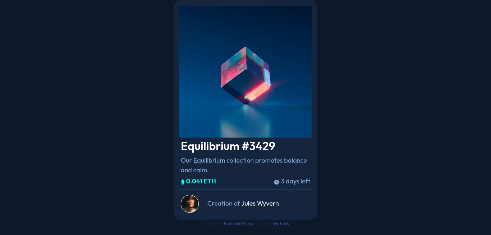

# Frontend Mentor - NFT preview card component solution

This is a solution to the [NFT preview card component challenge on Frontend Mentor](https://www.frontendmentor.io/challenges/nft-preview-card-component-SbdUL_w0U). Frontend Mentor challenges help you improve your coding skills by building realistic projects. 

## Table of contents

- [Overview](#overview)
  - [The challenge](#the-challenge)
  - [Screenshot](#screenshot)
  - [Links](#links)
- [My process](#my-process)
  - [Built with](#built-with)
  - [What I learned](#what-i-learned)
  - [Continued development](#continued-development)
  - [Useful resources](#useful-resources)
- [Author](#author)

## Overview

### The challenge

Users should be able to:

- View the optimal layout depending on their device's screen size
- See hover states for interactive elements

### Screenshot



### Links

- Solution URL: [GitHub](https://github.com/TrudyCyns/NFT-Preview-Card)
- Live Site URL: [GitHub Pages](https://trudycyns.github.io/NFT-Preview-Card/)

## My process

### Built with

- Semantic HTML5 markup
- CSS custom properties
- Flexbox
- Mobile-first workflow
- BootStrap 5.1

### What I learned

I learned how to overlaa=y SVGs over images. It gave me some hard time and I actually couldn't center the svg. However, I learned the concept.

```html
<div class="img-overlay-wrap">
      
      <svg width="48" height="48" xmlns="http://www.w3.org/2000/svg">
        <g fill="none" fill-rule="evenodd">
          <path d="M0 0h48v48H0z" />
          <path
            d="M24 9C14 9 5.46 15.22 2 24c3.46 8.78 12 15 22 15 10.01 0 18.54-6.22 22-15-3.46-8.78-11.99-15-22-15Zm0 25c-5.52 0-10-4.48-10-10s4.48-10 10-10 10 4.48 10 10-4.48 10-10 10Zm0-16c-3.31 0-6 2.69-6 6s2.69 6 6 6 6-2.69 6-6-2.69-6-6-6Z"
            fill="#FFF" fill-rule="nonzero" />
        </g>
      </svg>
    </div>
```

```css
/* SVG Overlay */
.img-overlay-wrap {
    position: relative;
    display: inline-block;
}

.img-overlay-wrap img {
    display: block;
    max-width: 100%;
    height: auto;
}

.img-overlay-wrap svg {
    display: none;
}

.img-overlay-wrap:hover svg {
    display: block;
    background-color: hsl(178, 100%, 50%, 0.3);
    position: absolute;
    top: 0;
    left: 0;
    height: 100%;
    width: 100%;
    align-items: center;
}

.img-overlay-wrap:hover {
    cursor: pointer;
}

```

### Continued development

I'd like to continue learning how to play around with SVGs and understand what they are made of. I would also like to focus on other kinds of images I can use and manipulate in HTML.

### Useful resources

- [Stack Overflow](https://stackoverflow.com/questions/43806515/position-svg-elements-over-an-image) - This helped me figure out how to put the SVG over the Ethereum Image.

## Author

- Frontend Mentor - [@TrudyCyns](https://www.frontendmentor.io/profile/TrudyCyns)
- Twitter - [@GNabasirye](https://www.twitter.com/gnabasirye)
